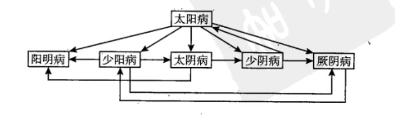

## 关于六经辩证

### 三阴三阳的本义

|      | 阴、阳的多少（数字表示） |
| ---- | ------------------------ |
| 太阳 | 三阳                     |
| 阳明 | 二阳                     |
| 少阳 | 一阳                     |
| 太阴 | 三阴                     |
| 少阴 | 二阴                     |
| 厥阴 | 一阴                     |

### 三阴三阴在《黄帝内经》中的含义

### 三阴三阳在《伤寒论》中的含义

|      | 病变部位                   | 病变性质、趋势                                         |
| ---- | -------------------------- | ------------------------------------------------------ |
| 太阳 | 足太阳膀胱经，膀胱，体表   | 阳症，阳症的初起                                       |
| 阳明 | 手阳明大肠经，足阳明胃经， | 阳症，阳症的极期                                       |
| 少阳 | 手少阳三焦经，足少阳胆经， | 阳症，阳症的后期                                       |
| 太阴 | 足太阴脾经，脾脏，         | 阴症，阴症的初期                                       |
| 少阴 | 手少阴心经，足少阴肾经     | 阴症，阴症的危重期                                     |
| 厥阴 | 手厥阴心包经，足厥阴肝经， | 厥阴情况复杂：                                         |
|      |                            | 如果是少阴传来的，就是阴症的末期（有死无生，阳亡而死） |
|      |                            | 阳复，阴尽阳生                                         |

### 六经病的传经和变症

六经病的传经图：

**变症**：因为失治、误治导致临床上症状的变化，症状不属于六经病，叫做**变症**或者**坏病**。

**变症的治疗法则**：观其脉症，知犯何逆，随症治之。

## 六经病的发病

|                  |                                                          |
| ---------------- | -------------------------------------------------------- |
| 合病（限三阳经） | 两个以上阳经同时发病。                                   |
| 并病（限三阳经） | 一经症猴未罢，又出现了另一经的症候。发病有先后次第之分。 |
| 直中             | 外邪不经过三阳经，直接侵犯三阴而发病。                   |

杂记：

春夏养阳，秋冬养阴。

老怕伤寒，少怕痨。（老年人肾阳虚寒，就怕外邪直中少阴）

伤寒专死下虚人。（下元虚损，肾阳不足的人，一得外感就容易表现出少阴直中的特征）

## 六经辩证和其他辩证关系

八纲辨证，是后世医夹从六经辩证中提取出来的一个大的纲领，从六经辩证中提取出来的辩证方法和思路，可以辩引用、虚实、寒热等。缺点是不能用于指导临床用方。（郝万山说的）

## 中医的治理观念

先解表，再攻下。

## **太阳病**（中风、伤寒、温病）

##### 1、太阳之为病，脉浮，头项强痛而恶寒。

太阳病，脉是浮的，怕冷，头和脖子僵硬，感觉脑子在晃动，胀疼（指头和脖子拘急，转动不丝滑。**强**→拘禁不柔和）。

**头项强疼**：头和脖子僵硬，脑胀也晃，胀疼。指头和脖子拘急，转动不丝滑。（**强**→拘禁不柔和） 

##### 2、【太阳病】发热，汗出，恶风，脉缓者，名为【中风】。

有太阳病的症状，并且发热，出汗（必须有），怕风，并且脉缓的，叫做中风。

##### 3、【太阳病】，或已发热，或未发热，必恶寒，体痛，呕逆，脉阴阳俱紧者，名曰【伤寒】。

太阳病的症状，有发热或者未发热，怕冷（必须有），体痛，恶心，想吐，寸脉和尺脉都紧的，叫做伤寒。

**体痛**：头疼，身疼，腰疼，骨节疼痛，全身肌肉疼，全身骨节疼。

**呕逆**：反胃，干呕，恶心，想吐。呕吐或者想呕吐又呕不出。

**阴阳脉俱紧**：寸脉，尺脉都紧。

寸	→	阳

关	

尺	→	阴

##### 4、【伤寒】一日，【太阳】受之，脉静者，为不传也；若脉数急者，为传也。

刚开始得病的时候在表，表病入里的时候有2种可能：

1）跑到肠胃里面去，就是阳明症，到此为止就结束了（阳明无死症），不会再进了。

2）如果进入少阳，下一步就是太阴，厥阴。

3）如果六天了，脉还没有变。代表病不会往里面传了。（如果刚开始脉浮缓，6天后还是浮缓，代表病不会往里面传；如果脉由浮缓变了，变成浮数，则代表病会传）

**一日**：这里的一日，是指6天或者一个星期。

**脉静**：不是指安静，而是指脉没有变。比如原来脉是浮缓还是浮缓。

##### 5、【伤寒】二三日，【阳明】、【少阳】症不见者，为不传也；颇欲吐，若烦躁者，为传也。

有欲吐的感觉，就说明病已经进入少阳，烦躁就说明这个是阳明症，说明病已经往里面走了。

**阳明症**：但热不寒，烦躁，阳明看不到寒症，只有热症。

**少阳症**：往来寒热，忽冷忽热，恶心，想吐。

**烦躁**：脾气暴躁，心情不好，丢东西，摔东西，睡觉睡不安稳，手脚躁动也叫做烦躁，小孩子好动跑来跑去也叫做烦躁，烦躁的定义很广。动作上没有办法定下来，情志上没有办法安静下来，晚上睡觉睡不好，都叫做烦躁。

##### 6、【太阳病】，发热而渴，不恶寒者，为【温病】。

发热而渴就是温病。温病来自冬天的寒。

从霜降以后进入冬天开始冷，得到了伤寒，隔年到春天，到夏至之前发出来的热证就叫做温病。夏至以后就看不到温病了，夏至以后就是热和湿热两种。

按照节气的正气走，春天是暖的，夏天是热的，秋天是凉的，冬天是寒的，根据节气而得到的病，就是一般的病。如果是节气不对所得到的病就是疫病。

##### 7、若自汗出，身炙热者，名曰【风温】。

如果病人一直汗流不止，身体是烫的，叫做风温。

发表的药开太过也会造成风温的现象。

得了伤寒，再自己恢复的过程当中也会发温病，是一种混合的现象。比如得了伤寒，流汗，流汗好了以后工作或者运动又出汗，又得到感冒，就会造成汗流不止的现象。

##### 8、【风温】为病，脉阴阳俱浮，汗自出，身重，多眠睡，息必鼾，言语难出。若发汗者，小便不利；若被下者，直视，失溲；若被火者，微发黄色，剧则如惊痫，时瘛瘲，若火熏之。一逆尚引日，再逆促命期。（这段可能有误，合其他版本不一致）

风温，本身已经在流失津液，出现身重，多睡眠就是脱水很多了，所以就讲话难，身重。如果在误吃了发汗的药，小便不利。

如果用了攻下的药，小肠大肠里面的食物被攻出来，津液的源头就没了，病人小便控制不住，滴漏，眼睛也转不动了。

如果这个时候，再烤火，失掉水分，病人就会很危险。

**瘛瘲**：抽动，抽筋。

##### 9、病有发热恶寒者，发于【阳】也；无热恶寒者，发于【阴】。发于阳者七日愈，发于阴者六日愈；以阳数七，阴数六故也。

就是间隔6天，第一天得病的那天不算。发于阳，白天得的病；发于阴，晚上得的病。这是不经过治疗，自己好的节奏。

##### 10、【太阳病】，头疼至七日以上自愈者，以行其经尽故也。若欲作再经者，针【足阳明】，使经不传则愈。

太阳病（伤寒，中风，温病），当它传经的时候，会先进入阳明。

如果一问病人得病几天了，病人说6天了，为了防止传经，先针足阳明本穴（足三里），这样就不会传经了。（6天了还没好再针）。

##### 11、【太阳病】欲解时，从巳至未上。

阳病恢复的时候是在中午，阴病恢复的时候是在半夜。

脏有病的时候，都是半夜胃气恢复；腑（消化系统）有病的时候，都是在中午胃气恢复。

##### 12、【中风】表解而不了了者，十二日愈。

中风，如果解表了，不会在恶风了，也不会再流汗了，可是还是一点点，十二天后好。

##### 13、14、病人身大热，反欲得衣者，热在皮肤，寒在骨髓也；身大寒，反不欲近衣者，寒在皮肤，热在骨髓也。

**真寒假热**：病人身上一摸全身滚烫，反而想要多加衣服，这是里寒，真寒假热。 

**真热假寒**：病人身上很凉，但是却不想要穿衣服，这是里热，真热假寒。

伤寒论里面，对寒热的区分：阴盛（**阴实**），阴亡；阳盛（**阳实**），阳亡。

张仲景只区分实，而看不到虚。治病的时候不用补药，张仲景小补：甘草。中补：大枣，白芍。大补：人参。

补药是正常的时候，健康的时候吃，没病的时候吃。

##### 15、【太阳中风】，阳浮而阴弱。阳浮者热自发，阴弱者汗自出。色色恶寒，淅淅恶风，翕翕发热，鼻鸣干呕者，桂枝汤主之。

## 脉的相关

**浮	沉	迟	数**

浮，数 → 阳

沉，迟 → 阴

**阳脉**：首先是**浮**，后面跟着的是**大、动、滑、数**

**阴脉**：首先是**沉**，后面的是**涩、微、弱、弦**

刚得病的时候，浮脉（阳脉）变沉脉（阴脉）是病进，反之则是病退！

阳有病，不见阴脉。任何的病，当见阳脉！

## 名词解释：

#### **正气病**

按照节气而得到的病。

#### **疫病**：

**小便不利**：小便不好排，小便滴滴哒哒，小便疼，小便热烫，尿完感觉还有。

