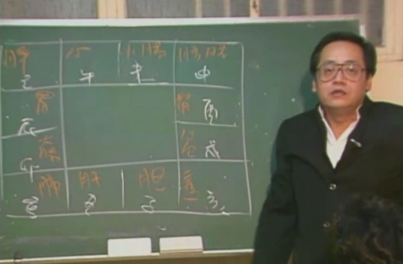
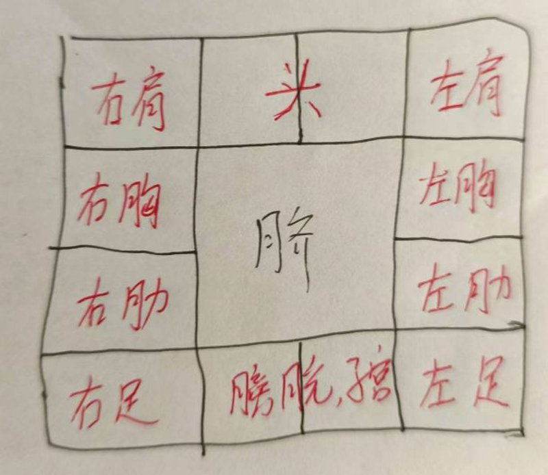
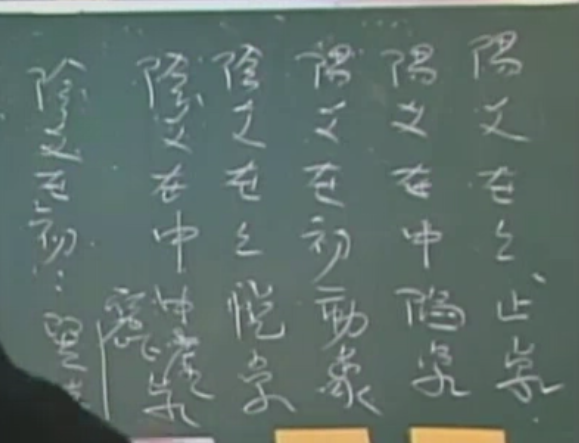

## 宫位和身体疾病的对应

**肺寅大卯胃辰宫，**

**脾巳心午小未中，**

**申胱酉肾心包戌，**

**亥焦子胆丑肝通。**

判定身体状况不要看疾厄宫，要看杀星在哪些宫位，具体什么时候发看小限。

## 星耀

### 北斗星系

#### 紫微星（阳星）

帝星，北斗星君。遇左辅右弼最佳。官带星，文武官星，官星进官禄宫最好。具有解厄制化的功能，逢凶化吉。贵人星。

面相：五官长的很开，脸宽宽大大的，厚重，不苟言笑。

如果命坐 紫薇，如果没有左辅右弼，孤星，主孤独，僧道，喜欢一个人。

如果福德宫只有一颗紫薇星，有其是女孩子，一辈子是孤星。

#### 天机星（阴星）

官星，武官星

长相：黑黑的，个矮，体格精壮，聪明，反应快。

#### 太阳星（）

武官星（军人，警察，法官，外交官），代表财禄。贵人星。

太阳星在官禄宫就主官，在财帛宫就主财。太阳星主横财（做生意做老板，不知道下月能挣多少钱）

主父亲，儿子，丈夫。

长相：红光满面，双目圆大，圆脸。太阳星坐命的人：肤白，个子中等身材。

#### 武曲星

武官星，也代表财星，财星的王。贵人星。

长相：个子矮壮，五短（象上来说主贵，主富）

#### 天同星

人和星。

#### 廉贞星

1，桃花星。2，武官星。

### 南斗星系

#### 天府星

南斗星君，统帅南斗诸星。没有解厄制化的作用。温和的星，代表个性温和。文官星，教星。文官带。心眼比较多，

#### 太阴星

月亮，女命做太阴漂亮。文官带，正禄。

#### 天梁星

食神，文武双全，非常的好。坐命男长得好看，个子不高，比较精壮。 

#### 天相星

佐才星，天相入命适合当参谋，师爷。个子瘦瘦高高的。对人谦和，厚道，脾气温和。天相星入命的人是比较好的结婚对象。

#### 七杀、破军、贪狼

这3个星是一组，性刚，刚强，固执，容易被人利用。

七杀入命的人目大，性急，多疑。 

破军入命的人比较孤僻，不重利，

贪狼星是主桃花星，酒，色，财，气，赌。魁梧，大，毛发多。

事业上来说，七杀，破军这2颗星主耗，劳。贪狼主财

## 六杀星

羊驼、陀罗、火星、铃星、天空、地劫

如果杀星落陷，差中之差，凶中之凶。

如果杀星庙旺，那么凶星会变吉星。（吉处藏凶→【必凶】，凶处藏吉→【平安】）

## 总格

1、日月夹财

2、紫府夹权

3、魁钺夹贵

4、羊驼夹杀（容易被人影响）

#### 副星

文曲：主才艺，博学，看起来斯文，文绉绉的。

文昌：主科甲，考试。坐命，没有文曲来会的话，书呆子。会到的话就是文采风流。如果化忌，代表有考试，但是不中。

天魁，天钺，科甲星。

红鸾，天喜，代表喜事的星。男人命带红鸾必招美妻，女命红鸾必有贵夫。女命带红鸾长的漂亮，看的清楚。

左辅右弼：辅助紫微星的。

三台八座：辅助天府星。天府星遇到三台八座才有解厄制化的能力。

## 十二宫

### 田宅宫

1、代表祖产有多少。

2、代表自产吉与不吉。

## 64卦

### 坎卦

自然界指水。

人间道指险、陷。

代表次男。

性：行险之道

志诚，志刚，只要有坚心即可脱险。

### 艮卦

自然界指山。

性：大，止

代表3子，小子。

## 杂记

女人：声音沙哑，骨粗，面紧的，主孤独一世。

春分，夏至，秋分，冬至这四个节气前一日为**离**日。

立春，立夏，立秋，立冬这四个节气前一日为**绝**日。

离日和绝日这8天是一年中大凶的日子。